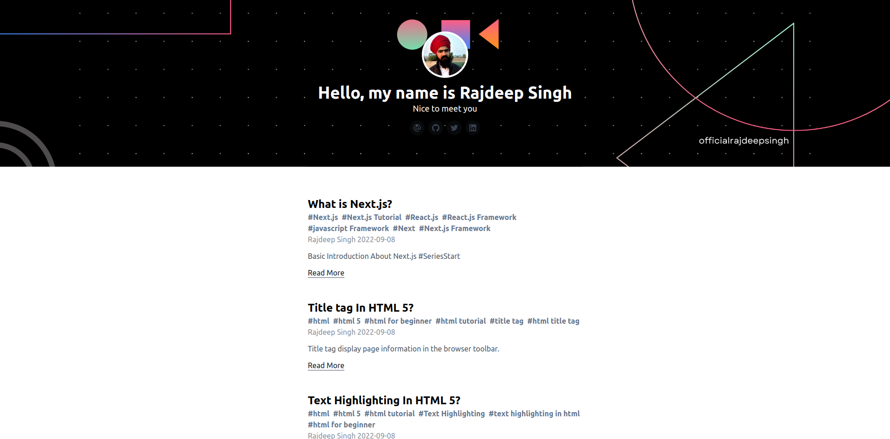

To create a static markdown blog with deno. You need a [blog module](https://deno.land/x/blog) to create a static blog with deno. I write full article on a static markdown blog.


## How to play with deno-markdown-blog 
Firstly Clone repo `git clone https://github.com/officialrajdeepsingh/deno-markdown-blog.git` and run local development server with `deno task dev` command. For running the local and production development, you need create a `.env` file and add  `URL` environment variable. In the `URL` environment variable, you need a production ready domain. 

```bash
// .env

URL=https://deno-markdown-blog.deno.dev/
``` 

The `URL` environment variable help to load you asset,image and icon with correct path in your blog. Understand with with a example

```typescript
// main.tsx

blog({
  avatar:`${Deno.env.get("URL")}assets/logos/profile.jpg`,
  favicon: `${Deno.env.get("URL")}favicon.ico`,
  cover:`${Deno.env.get("URL")}assets/logos/backgroundbanner.png`,
  ogImage: {
    url: `${Deno.env.get("URL")}assets/logos/Frame.png`,
    twitterCard:"summary_large_image" 
  },
});


```

## DEMO 

